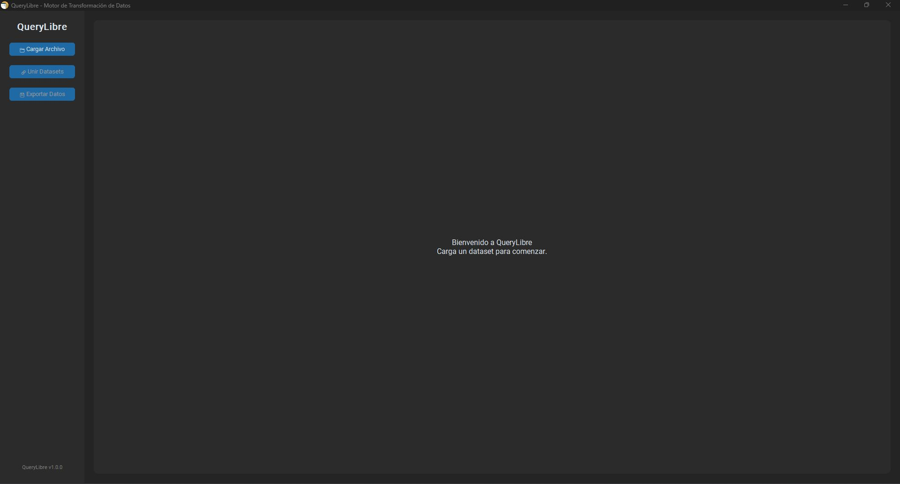
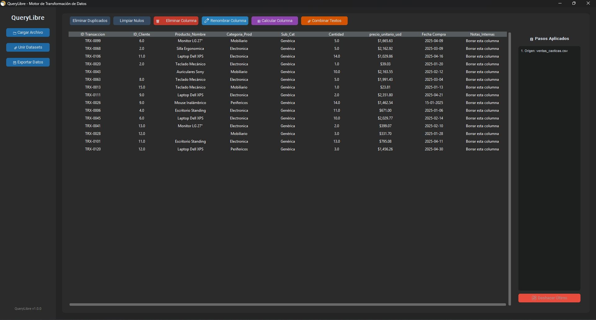

# 🔍 QueryLibre - Motor de Transformación de Datos (ETL)


QueryLibre es una aplicación de escritorio ligera e independiente, desarrollada 100% en Python, diseñada para democratizar la limpieza y transformación de datos. Permite a los usuarios cargar, procesar, unir y exportar bases de datos sin necesidad de escribir código o depender de software pesado.

> **💡 Motivación:** Llevar la potencia del procesamiento vectorizado de Pandas a una interfaz gráfica intuitiva, similar a Power Query, pero en un entorno de código abierto, escalable y de ejecución local.

---

## 📸 Interfaz de Usuario

**Pantalla de Bienvenida (Estado Inicial)**


**Entorno de Trabajo (Dataset Cargado y Herramientas Activas)**


---

## 🚀 Características Principales (v1.3.0)

* **Arquitectura Escalable (MVC):** Motor de datos (`core/data_engine.py`) completamente desacoplado de la interfaz gráfica, garantizando rendimiento y código limpio.
* **Carga Universal y Navegación:** 
    * Soporte nativo para importar datasets en formatos `.csv`, `.xlsx` y `.xls`.
    * **Paginación Dinámica:** Renderizado eficiente para datasets masivos, dividiendo la vista en bloques navegables sin congelar la UI.
* **Interacción Inteligente:**
    * **Edición Directa:** Modificación rápida de celdas al estilo Excel mediante doble clic, integrada al sistema de auditoría.
* **Data Cleaning a un Clic:**
    * Eliminación automática de filas duplicadas y valores nulos (`NaN` / `Null`).
    * Eliminación y renombrado intuitivo de columnas con validación de seguridad.
* **Feature Engineering Avanzado:**
    * **Filtrado Condicional:** Segmentación de filas mediante operadores lógicos (Igual, Contiene, Mayor, Menor, Vacío).
    * **Dividir Columna (Split):** Separación de textos en múltiples columnas mediante delimitadores.
    * **Calculadora Mágica:** Operaciones matemáticas (+, -, *, /) con un *Smart Parser* que limpia formatos de moneda automáticamente.
    * **Fusión de Textos:** Combinación de columnas con separadores personalizados y limpieza de artefactos.
* **Integración Relacional (Merge/JOIN):** Cruce visual de tablas dimensionales (Left Join, Inner Join) con pre-visualización de datos interactiva.
* **Sistema de Auditoría (Time Travel):** Historial en tiempo real de transformaciones (Pila LIFO) que permite "Deshacer" (Undo) acciones paso a paso de forma segura.
* **Exportación Industrial:** Descarga de los datos limpios en `.csv`, `.xlsx` o inyección directa a bases de datos relacionales `.db` (SQLite).

---

## 🗺️ Roadmap (Próximas Funcionalidades)
El motor de QueryLibre está en constante evolución. Las siguientes características están planificadas para las próximas versiones (v1.3+):

- [ ] **Sistema de Pestañas (Tabs):** Soporte nativo para trabajar con múltiples datasets en simultáneo en la misma sesión.
- [ ] **Data Profiling (Radiografía):** Panel lateral estadístico para auditar columnas al instante (conteo de nulos, min/max, valores únicos).
- [ ] **Motor de Macros:** Capacidad de grabar, guardar (JSON) y reproducir pipelines de transformación para automatizar tareas repetitivas.
- [ ] **Agrupación de UI (Ribbon):** Reestructuración de la barra de herramientas en menús desplegables categorizados (Limpieza, Estructura, Análisis) para una interfaz más limpia.
- [ ] **Casteo de Tipos (Data Types):** Herramienta para forzar la conversión de columnas (Texto ➔ Fecha, Texto ➔ Número).
- [ ] **Buscar y Reemplazar:** Reemplazo masivo de valores específicos en todo el dataset.
- [ ] **Agrupación y Resumen (Group By):** Creación de tablas dinámicas con funciones de agregación.

---

## 🛠️ Tecnologías Utilizadas

* **Motor Lógico:** `pandas` (Manipulación intensiva y vectorizada).
* **Interfaz Gráfica (GUI):** `customtkinter` (Diseño moderno, modo oscuro) y `tkinter` (`Treeview` avanzado).
* **Estructura:** Patrón de Arquitectura MVC (Model-View-Controller).
* **Sistema de I/O:** `os`, `sys`, `sqlite3`.
* **Empaquetado:** `pyinstaller` (Compilación a binario ejecutable `.exe` standalone).

---

## 📦 Instalación y Uso (Para usuarios finales)

No es necesario instalar Python ni librerías para usar QueryLibre.

1. Ve a la sección de **Releases** en este repositorio (panel derecho).
2. Descarga el archivo `QueryLibre.exe`.
3. Ejecútalo haciendo doble clic. *(Si Windows Defender muestra una advertencia de SmartScreen, haz clic en "Más información" -> "Ejecutar de todas formas").*

---

## 💻 Para Desarrolladores

Si deseas clonar el proyecto para auditar el código, explorar la separación de capas MVC o contribuir:

1. Clona este repositorio: 
   ```bash
   git clone [https://github.com/IvanRavarotto/QueryLibre.git](https://github.com/IvanRavarotto/QueryLibre.git)
2. 

3. 